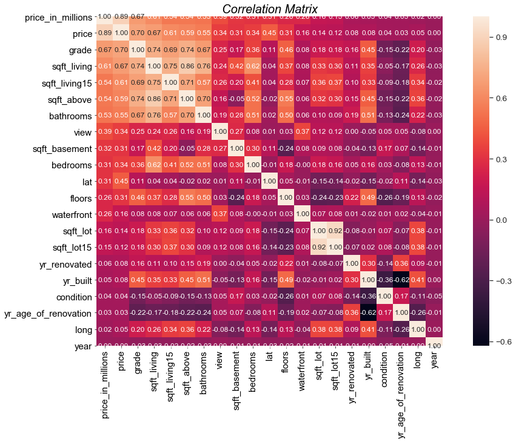
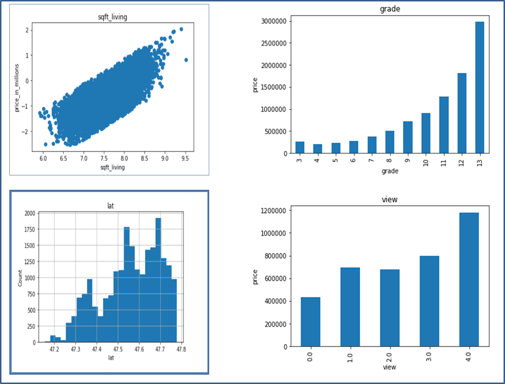

### Kings_County_Housing_Price_Prediction -A Linear Regression Project

#### Overview:

Predicted suburban housing prices using Linear Regression on an  existing dataset on **King county Washington** .

The purpose was to model the said data and analyse the results to assist builders on :

- what kind of property to build. 

- What is the price range the property should be.

- What are the facility that sell the most and people seek to buy based on the available data.

The data includes homes sold between May 2014 and May 2015. 

#### Exploratory Data Analysis:

The features and structure of the data showed the price that each house sold for and the prediction target as well a number of predictor variables such as number of bed rooms , bathrooms , sqft area of living , lot , floors, how many times the house has been viewed etc . Some of the points that the data revealed initially 

- The newer built and renovated houses were sold the most
- The lower valued houses has been sold the maximum
- Average or better condition has an influence in the house being sold
- The house with view and water front has an higher price and lower volume of sales

##### Other Observations:

- There are three columns with null values , waterfront , view, yr_renovated which needs to be filled
- The date columns needs to be converted to datetime stamp from object
- The yr_renovated column needs to be converted to float from string

#### Feature Engineering

The Data Exploration was further carried out with feature engineering the main objective was to find out 

- Engineer and transform the features and the target variable
- Shortlist few features
- Set base to Build a model based on which feature affected the price 
- Further make and submit predictions

The following process were carried out :

- Checking percentage of nan values and list of features which has missing value
- No Null values or missing value detected
- Finding relationship between each column having missing value and sales price
- Confirming all columns as Numerical variables
- Datetime variable and two types of Numerical Variables: Continous & Discreate Variable were worked on
- Finding distribution of continous feature / variable with histogram
- Logarithmic transformation: Applying log normal distribution for dependent(price_in_millions) and independent(others) feature to check the relationship 
- Checking the Outliers in the features using Box Plot
- Dropping Outliers
- Feature Scaling: Transforming the train and test set, and add on the id and price variables
- Multicollinearity :using heat map for checking multi_collinearity between variables

**Over all Observation: here we can see that there is a strong & positive monotonic relationship between the price_in_millions and other features like sqft_living , sqft_above & sqft_living15**

**The important features to focus on seem to be sqft_living, , grade , view , lat,** 

#### Lasso model was used to confirm the same

#### Linear Regression

#### The process carried out were : 

- Engineer and transform the features and the target variable

- Importing file and using the selected features as the subset for feature interpretation

- Creating histogram and check the shape to see if it is uniform or not

- Check the linearity assumption for all chosen features with target variable using scatter plots 

- Regression Analysis and Diagnostics for price_in_millions

- 

- 

  **Observation**

  The features with highest r_squared were

  - sqft_living 0.374346
  - view 0.154650
  - grade 0.446158
  - sqft_above 0.294497
  - sqft_basement 0.103110
  - sqft_living15 0.295749

  **Probability distribution**

- Distribution plots are used to show a probality distribution.

- For a normal distribution, the ideal skewness and kurtosis value is approximately 0.

- Skewness is a measure of the asymmetry of the probability distribution of a random variable about its mean.

- Kurtosis is used to describe the extreme values in one versus the other tail of a distribution.

  **Normalization**

- As a general rule of thumb: If skewness is less than -1 or greater than 1, the distribution is highly skewed. If skewness is between -1 and -0.5 or between 0.5 and 1, the distribution is moderately skewed. If skewness is between -0.5 and 0.5, the distribution is approximately symmetric.

- Both skew and kurtosis can be analyzed through descriptive statistics. Acceptable values of skewness fall between − 3 and + 3, and kurtosis is appropriate from a range of − 10 to + 10 when utilizing SEM (Brown, 2006).

- **KDE - Plotting histogram _ to check the distribution of predictors**

- Testing linearity assumption
- Jointplot - Checking for Linearity 

### Interpretation final model5

- Based on the target variable : price_in_millions, the multi co-linearity and some other details lets interpret the statistical significance of Model5 - the P-Value, the overall F statistics, the R squared value etc
- The Adjusted R Square post penalizing R squared values that include non useful predictors is 0.587 which is same as the R squared which indicate that the model is a well fitted model and is not blowing the overall model performance out of proportion. Also its indicating the model has relevant features
- the intercept value in this case is -0.0710
- As we see the P values is Zero which is better than the targeted value of 0.05 and the f statistics value is large we can reject the null hypothesis as we can see the evidence that the selected features and the target variable have a linear relationship
- As we can see the T value of Sqft living -View & grade dominate the rejection of the null hypothesis and accept the alternate hypothesis with their high T values and 0 P value
- The pre transformation and post transformation values in these features did not show much difference so it can be confirmed that the features like Sqft living , grade and view play a vital role in influencing the price and sale of the property
- Considering that the co-linearity between these features are the least or negligible we can easily confirm the accuracy of the model
- Finally As we know linear regression is not the best model for this dataset it will be advisable to run other regressors to check better options

**Thank You**
